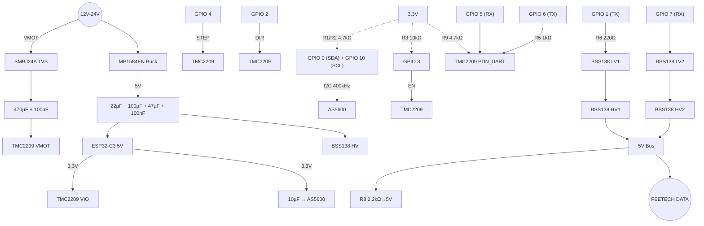

# SmartServoStepperV2 – PCB Wiring & Schaltplan (v2.0 Verified)

Dieses Dokument ist der **Master-Bauplan** für das PCB-Layout, abgeglichen mit der Hardware-Spezifikation v2.0 (Stabilisiert & Getestet).

---

## 1. Systemarchitektur & Power Grid

### VMOT (12V–24V)
- **Schutz:** SMBJ24A TVS-Diode (transiente Überspannungen) + 100nF Keramik (HF)
- **Puffer:** 470 µF / 50V Elko (Low-ESR) unmittelbar am TMC2209 VM/GND

### 5V System (SYS)
- **Quelle:** MP1584EN Buck-Converter (Ausgang lokal gepuffert mit 22µF Keramik)
- **MCU-Puffer:** 100 µF Elko + 47 µF Keramik (X7R, 1206) + 100 nF direkt am ESP32 5V-Pin

### 3.3V Logik (LOGIC)
- **VIO TMC2209:** Zwingend mit 3.3V verbinden (nicht 5V!)
- **AS5600 Puffer:** 10 µF Keramik nahe am Sensor

---

## 2. Finales Pin-Mapping (ESP32-C3 Super Mini)

| ESP32-C3 Pin | Funktion | Beschreibung | Hardware-Beschaltung |
| :--- | :--- | :--- | :--- |
| **GPIO 0** | SDA | I2C Daten (AS5600) | 4.7kΩ Pull-UP gegen 3.3V |
| **GPIO 1** | Feetech TX | Bus Senden (Half-Duplex) | Via 220Ω Serienwiderstand → BSS138 Level Shifter |
| **GPIO 2** | DIR | Richtungs-Signal | Direkt |
| **GPIO 3** | ENABLE | TMC2209 EN (Active LOW) | 10kΩ Pull-UP gegen 3.3V (Boot = AUS) |
| **GPIO 4** | STEP | Schritt-Impuls | Direkt |
| **GPIO 5** | UART RX | TMC2209 Kommunikation | Direkt an PDN_UART (TMC) |
| **GPIO 6** | UART TX | TMC2209 Kommunikation | **1kΩ Schutzwiderstand** in Serie zu PDN_UART |
| **GPIO 7** | Feetech RX | Bus Empfangen (Half-Duplex) | Direkt → BSS138 Level Shifter |
| **GPIO 8** | Status-LED | On-Board LED (Blau) | Intern (Active LOW) |
| **GPIO 10** | SCL | I2C Takt (AS5600) | 4.7kΩ Pull-UP gegen 3.3V |
| **GPIO 18/19** | USB/JTAG | D- / D+ | **Physisch unbeschaltet lassen!** (Intern für USB reserviert) |

---

## 3. Spezifische Schaltungsdetails

### 3.1 ENABLE-Logik (Kritisch)
- **Logik:** TMC2209 aktiv bei LOW. 10kΩ Pull-Up zieht GPIO 3 beim Booten auf HIGH (Disabled).
- **Firmware:** Erst nach Initialisierung aller Sensoren (AS5600, TMC2209) wird GPIO 3 aktiv auf LOW gezogen.

### 3.2 Schritt- & Richtungssteuerung (STEP/DIR)
- **DIR (Richtung):** GPIO 2.
- **STEP (Schritt):** GPIO 4.
- **Firmware:** Werden über die `FastAccelStepper`-Library direkt angesteuert.

### 3.3 Feetech-Bus (High-Speed 1 Mbps)

TX- und RX-Pfade gehen beide auf den Level Shifter und werden auf der HV-Seite (5V) zusammengeführt:

```text
ESP32-C3                                             Feetech Bus (5V)
─────────                                            ────────────────
GPIO 1 (TX) ──→ 220Ω ──→ BSS138 (LV1) ──→ (HV1) ──┐
                                                  ├── DATA (1-Wire)
GPIO 7 (RX) ───────────→ BSS138 (LV2) ←── (HV2) ──┘
                                                  │
                                            2.2kΩ Pull-Up → 5V
                                         (Terminierung / scharfe Flanken)
```

- **TX-Pfad:** GPIO 1 → 220Ω Serienwiderstand → Level Shifter (LV1) → 5V Bus (HV1)
- **RX-Pfad:** GPIO 7 → Level Shifter (LV2) ← 5V Bus (HV2)
- **Terminierung:** 2.2kΩ Pull-Up gegen 5V am Bus-Ausgang

### 3.4 TMC2209 UART (Two-Wire Control)
- **GPIO 5 (RX)** → Direkt an TMC2209 PDN_UART.
- **GPIO 6 (TX)** → 1kΩ Serienwiderstand (R5) → TMC2209 PDN_UART.
- **Pull-Up:** Ein **4.7kΩ Widerstand (R9)** von PDN_UART nach 3.3V ist zwingend erforderlich für Signalintegrität.
- **Firmware:** SoftwareSerial bei **19200 baud**.

---

## 4. Stückliste (BOM)

### Aktive Bauteile
| Typ | Bauteil / Modul | Menge | Funktion |
| :--- | :--- | :--- | :--- |
| **MCU** | ESP32-C3 Super Mini | 1x | Hauptprozessor (Single-Core, 160MHz, WLAN) |
| **Driver** | TMC2209 Stepper Driver | 1x | Ultra-leiser Treiber (UART, StealthChop, CoolStep, StallGuard) |
| **Sensor** | AS5600 Magnetic Encoder | 1x | 12-Bit Absolut-Encoder (I²C) |
| **Comms** | BSS138 Level Shifter | 1x | 3.3V→5V für Feetech TX-Pfad |
| **Power** | MP1584EN Buck Converter | 1x | 12V→5V Step-Down |
| **Schutz** | SMBJ24A TVS-Diode | 1x | Transientenschutz VMOT |

### Passivbauteile
| ID | Bauteil | Wert | Position |
| :--- | :--- | :--- | :--- |
| C1 | Elko (Low-ESR, 50V) | 470 µF | VMOT / GND (am TMC2209) |
| C2 | Keramik | 100 nF | VMOT / GND (HF-Filter) |
| C3 | Keramik (X7R, 1206) | 47 µF | ESP32 5V / GND |
| C4 | Keramik | 100 nF | ESP32 5V / GND (Entkopplung) |
| C5 | Elko | 100 µF | ESP32 5V / GND (Bulk) |
| C6 | Keramik | 22 µF | Buck-Converter Ausgang |
| C7 | Keramik | 10 µF | AS5600 3.3V / GND |
| R1 | Widerstand | 4.7 kΩ | SDA (GPIO 0) → 3.3V (I2C Pull-Up) |
| R2 | Widerstand | 4.7 kΩ | SCL (GPIO 10) → 3.3V (I2C Pull-Up) |
| R3 | Widerstand | 10 kΩ | EN (GPIO 3) → 3.3V (Boot-Safe) |
| R5 | Widerstand | 1 kΩ | GPIO 6 (TX) → TMC PDN_UART (Schutz) |
| R6 | Widerstand | 220 Ω | GPIO 1 (TX) → Level Shifter (Serie) |
| R8 | Widerstand | 2.2 kΩ | Feetech Bus Terminierung (→5V) |
| R9 | Widerstand | 4.7 kΩ | PDN_UART → 3.3V (Kommunikations-Pull-Up) |

---

## 5. Layout- & Fertigungshinweise

- **Thermal Management:** Großflächige Ground-Planes auf Top- und Bottom-Layer. Unter TMC2209 "Exposed Pad" mindestens **5 Thermal Vias** (0.3mm Bohrung).
- **EMI-Schutz:** I2C-Leitungen (SDA/SCL) so kurz wie möglich. Räumlich von Motor-Phasen (A/B) trennen.
- **Kondensatoren:** 47µF Keramik muss **X7R-Dielektrikum** besitzen, min. 10V (besser 16V).
- **Mechanik:** Zentrales **6mm Loch** für Magnet-Halterung der Motorwelle.
- **USB/JTAG:** GPIO 18/19 physisch **unbeschaltet** lassen.

---

## 6. Architektur-Diagramm


