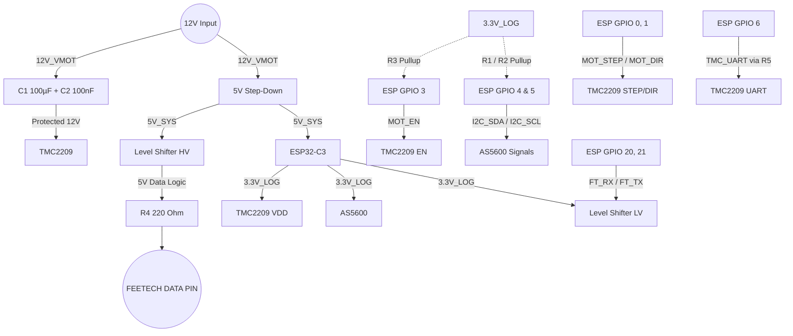

# Smart Servo Stepper V2 - PCB Wiring & Schematic Master

Dieses Dokument ist der **Master-Bauplan** für die Erstellung eines Custom-PCBs (Leiterplatte) in Software wie KiCad, EasyEDA oder Altium Designer. Es umfasst alle Bauteile, Stromkreise, Schutzbeschaltungen und Signalleitungen.

## 1. System-Komponenten (BOM / Stückliste)

| Typ | Bauteil / Modul | Menge | Funktion |
| :--- | :--- | :--- | :--- |
| **MCU** | ESP32-C3 Super Mini | 1x | Hauptprozessor (Single-Core, 160MHz, WLAN). |
| **Driver** | TMC2209 Stepper Driver | 1x | Ultra-leiser Schrittmotortreiber, konfiguriert via UART. |
| **Sensor** | AS5600 Magnetic Encoder | 1x | 12-Bit Absolut-Encoder (I²C) zur Positionserfassung. |
| **Comms** | BSS138 Dual Level Shifter | 1x | Konvertiert 3.3V UART zu 5V für den Feetech Bus. |
| **Power** | 5V DC/DC Step-Down (Buck) | 1x | Wandelt 12V in saubere 5V für ESP und Level Shifter um. |

### 1.1 Passiv-Bauteile (Protection & Hardening)
Diese Bauteile *müssen* auf der Leiterplatte vorgesehen werden:
| ID | Bauteil | Position | Zweck |
| :--- | :--- | :--- | :--- |
| **C1** | 100µF bis 470µF (Elko) | parallel zu `VMOT` / `GND` | Fängt Spannungsspitzen ab, schützt TMC2209 vor dem Durchbrennen. |
| **C2** | 100nF (Keramik) | parallel zu `VMOT` / `GND` | Hochfrequenz-Filterung für Motoreingang. |
| **C3** | 100nF (Keramik) | ESP32-C3 `3.3V` / `GND` | Entkopplung für die Logik (nahe am ESP-Pin platzieren). |
| **C4** | 100nF (Keramik) | TMC2209 `VDD` / `GND` | Entkopplung für die Treiber-Logik (nahe am VDD-Pin). |
| **R1, R2** | 4.7 kΩ Widerstand | `SDA` -> `3.3V` und `SCL` -> `3.3V` | Starke I²C Pull-Ups für schnelle 400kHz Taktung zum AS5600. |
| **R3** | 10 kΩ Widerstand | ESP32 `GPIO 3 (EN)` -> `3.3V` | Boot-Safe Pull-Up: Hält den Motor beim Booten zwingend ausgeschaltet. |
| **R4** | 220 Ω Widerstand | Level-Shifter 5V RX -> Bus | Kurzschlussschutz-Widerstand für die Feetech-Signalleitung. |
| **R5** | 1 kΩ Widerstand | ESP32 `GPIO 6` -> TMC `UART` | Begrenzt Stromspitzen auf der Treiber-UART-Datenleitung. |

---

## 2. Master Verdrahtungstabelle (Netlist)

Nutze diese Tabelle exakt so, um die "Nets" (Leitungsverbindungen) auf dem PCB zu benennen und zu ziehen.

### 2.1 Power Routing (Netzversorgung)
| Signal-Netz | Ursprung | Verbinden mit (Ziel-Pins) |
| :--- | :--- | :--- |
| **12V_VMOT**| 12V DC Input (+) | Step-Down Eingang (+), TMC2209 `VMOT`, Elko `C1` (+), Kerko `C2` |
| **GND** | 12V DC Input (-) | Alle GND-Pins: Step-Down, ESP32, TMC2209, AS5600, Level-Shifter, C1, C2, C3, C4 |
| **5V_SYS** | Step-Down Ausgang (+) | ESP32 `5V` (VBUS), Level-Shifter `HV` (High-Voltage) |
| **3.3V_LOG**| ESP32 `3.3V` Out | TMC2209 `VDD`, AS5600 `VCC`, Level-Shifter `LV`, R1, R2, R3, C3, C4 |

*(Wichtig: Die Masse-Leitung (GND) vom 12V Input bis zum TMC2209 sollte als dicke Polygon-Fläche (GND Plane) auf dem PCB ausgeführt werden, da hier hohe Ströme fließen.)*

### 2.2 Signal Routing (Logik-Verdrahtung)
| Signal-Name | ESP32-C3 Pin | Ziel-Modul | Ziel-Pin am Modul | Pfad-Beschreibung & Bauteile |
| :--- | :--- | :--- | :--- | :--- |
| **I2C_SDA** | `GPIO 4` | AS5600 | `SDA` | ESP `GPIO 4` direkt an AS5600 `SDA`. Knoten an Widerstand `R1` (nach 3.3V). |
| **I2C_SCL** | `GPIO 5` | AS5600 | `SCL` | ESP `GPIO 5` direkt an AS5600 `SCL`. Knoten an Widerstand `R2` (nach 3.3V). |
| **MOT_STEP**| `GPIO 0` | TMC2209 | `STEP` | Direkt verbinden. |
| **MOT_DIR** | `GPIO 1` | TMC2209 | `DIR` | Direkt verbinden. |
| **MOT_EN** | `GPIO 3` | TMC2209 | `EN` | ESP `GPIO 3` an TMC `EN`. Knoten an Widerstand `R3` (nach 3.3V). |
| **TMC_UART**| `GPIO 6` | TMC2209 | `UART` (Pin 4 od. PDN)| ESP `GPIO 6` über Serienwiderstand `R5` (1 kΩ) an TMC2209 UART-Pin. |
| **FT_TX** | `GPIO 21` | Level-Shifter | `LV1` | ESP `GPIO 21` an Level-Shifter (Low-Voltage Side 1). |
| **FT_RX** | `GPIO 20` | Level-Shifter | `LV2` | ESP `GPIO 20` an Level-Shifter (Low-Voltage Side 2). |

### 2.3 Feetech Bus Interface & Stecker
Auf der Platine benötigst du einen 3-Pin Stecker (z.B. JST oder Dupont) für den Feetech Bus:
| PCB Stecker Pin | Verbindung auf Platine |
| :--- | :--- |
| **Pin 1: GND** | System `GND` |
| **Pin 2: 5V/6V** | (Achtung: Feetech Servos brauchen meistens eigene starke Power, nicht vom kleinen Step-Down ziehen! Die 5V vom Step-Down sind nur für die Bus-Logik. Im Zweifel hier nichts auflegen oder separate Bus-Power nutzen.) |
| **Pin 3: DATA** | Beide Level-Shifter High-Sides (`HV1` und `HV2`) verbinden sich miteinander -> Durch den `220 Ω` Vorwiderstand (`R4`) -> DATA Pin. |

*(Hinweis zum Feetech Data Pin: Der Halb-Duplex wird erzeugt, indem der TX-Level-Shifter und der RX-Level-Shifter auf der 5V-Seite einfach hart miteinander verbunden werden).*

---

## 3. Architektur Diagramm (Signalfluss PCB)

