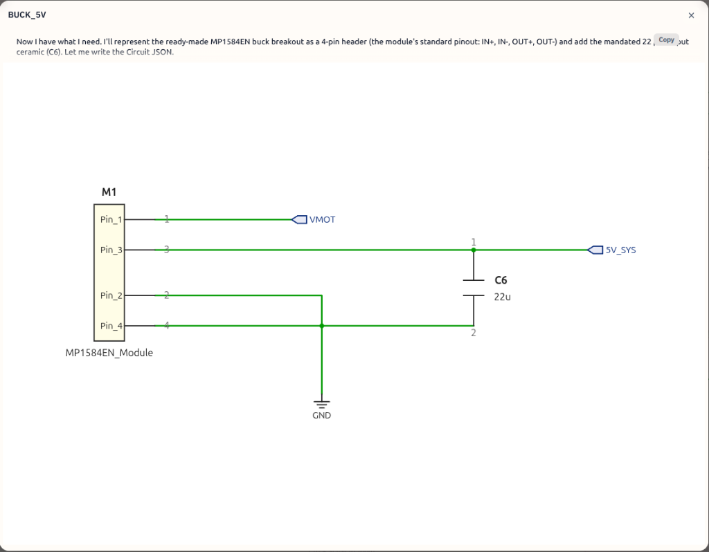
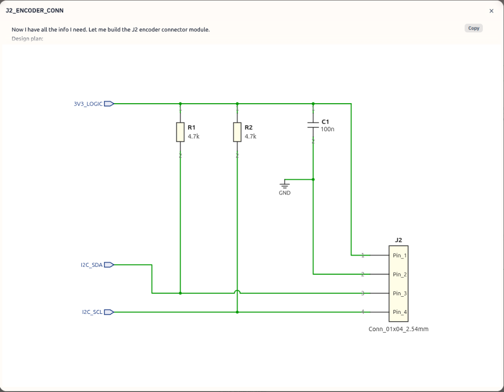
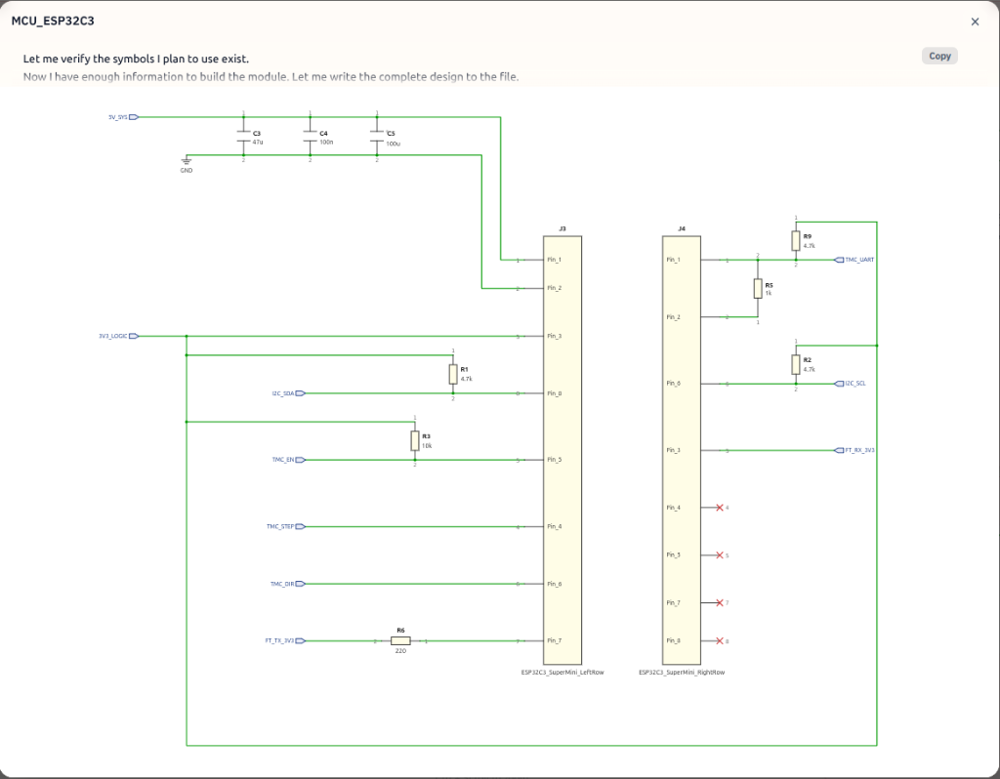
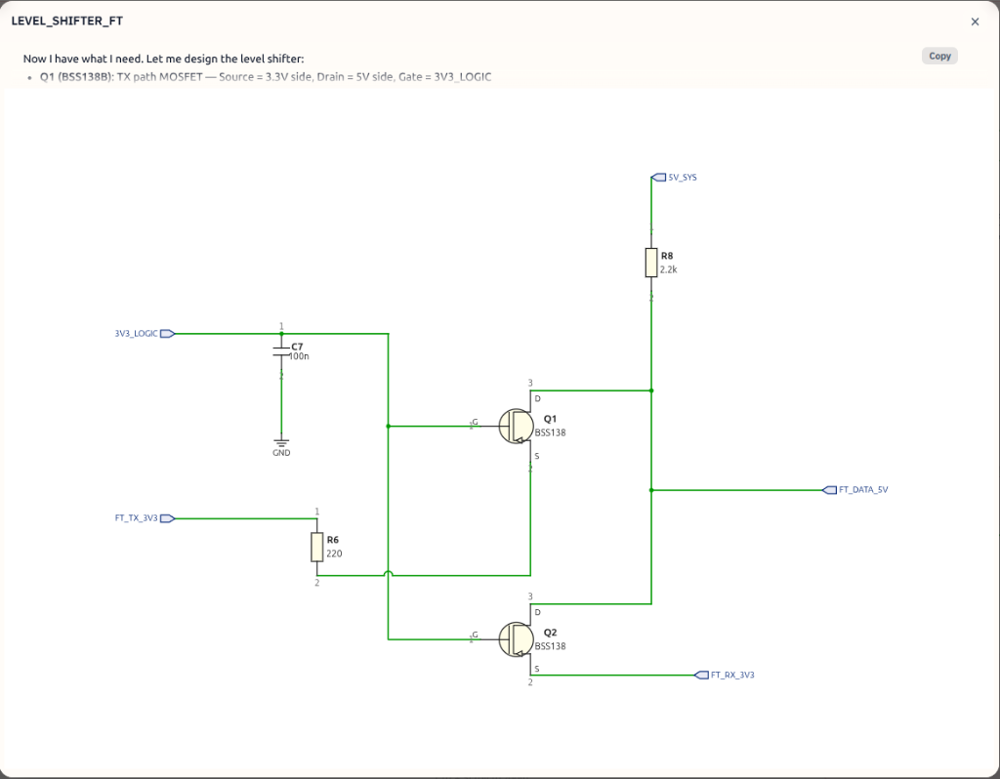
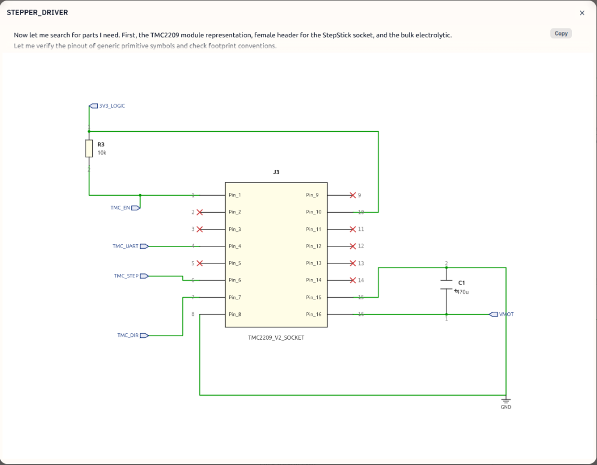

# SmartServoStepperV2 – PCB Wiring & Schaltplan (v2.2 Verified)

Dieses Dokument ist der **Master-Bauplan** für das PCB-Layout, optimiert für den Einsatz von fertigen Modulen (ESP32-C3 Super Mini + Tenstar TMC2209 V2) und externen Anschlüssen über Dupont-Steckverbinder.

---

## 1. Systemarchitektur & Power Grid

### VMOT (12V–24V) – Haupteinspeisung über Stecker [J1]

- **Quelle:** Pin 1 von Stecker J1 (3-pol. Dupont).
- **Schutz:** SMBJ24A TVS-Diode (transiente Überspannungen) + 100nF Keramik (HF-Filter) direkt hinter dem Stecker-Pin gegen GND.
- **Pufferung:** 470 µF / 50V Elko (Low-ESR) unmittelbar an den VM / GND Pins der Tenstar-Modul-Stiftleiste.

### 5V System (SYS) – Logik-Hauptstromkreis

- **Quelle:** MP1584EN Buck-Converter (Ausgang lokal gepuffert mit 22µF Keramik).
- **MCU-Pufferung:** 100 µF Elko + 47 µF Keramik (X7R, 1206) + 100 nF Keramik parallel geschaltet, so nah wie möglich am 5V-Pin des ESP32-C3 Super Mini Moduls.
- **Bus-Speisung:** Dient als Pull-Up-Quelle für die 5V-Busseite (1-Wire TTL).



### 3.3V Logik (LOGIC) – Signalstromkreis

- **Quelle:** Interner Spannungsregler des ESP32-C3 Super Mini (wird am 3V3-Pin des Moduls abgegriffen).
- **TMC2209 VIO:** Zwingend mit dieser 3.3V-Schiene verbinden.
- **Sensor-Speisung:** Wird direkt an Pin 1 des AS5600-Steckers J2 geführt.

---

## 2. Externe Steckverbinder (Interfaces)

### J1: Hauptanschluss (3-poliger Dupont-Stecker)

Dieser Stecker führt die Spannungsversorgung zu und bindet die Platine an den externen Feetech 1-Wire TTL Bus an.

| Pin | Signal | Beschreibung |
| :--- | :--- | :--- |
| **Pin 1** | `VMOT` | 12V–24V Eingang |
| **Pin 2** | `GND` | Gemeinsame Systemmasse |
| **Pin 3** | `FT_DATA` | 5V 1-Wire TTL Busleitung |

### J2: AS5600 Encoder-Anschluss (4-poliger Dupont-Stecker)

Über diesen Stecker wird das extern sitzende AS5600-Sensor-Modul ausgelesen.

| Pin | Signal | Beschreibung |
| :--- | :--- | :--- |
| **Pin 1** | `3V3_LOGIC` | Spannungsversorgung für den Sensor |
| **Pin 2** | `GND` | Masse |
| **Pin 3** | `I2C_SDA` | I2C Datenleitung, mit 4.7kΩ Pull-Up auf dem Mainboard |
| **Pin 4** | `I2C_SCL` | I2C Taktleitung, mit 4.7kΩ Pull-Up auf dem Mainboard |



---

## 3. Finales Pin-Mapping (ESP32-C3 Super Mini Modul)



| Modul Pin | Funktion | Beschreibung | Hardware-Beschaltung auf dem Mainboard |
| :--- | :--- | :--- | :--- |
| **5V** | `5V_SYS` | Moduleingang 5V | MP1584EN Ausgang / Bulk-Kondensatoren (C3, C4, C5) |
| **3V3** | `3V3_LOGIC` | Modulausgang 3.3V | Speist VIO (TMC), Stecker J2 Pin 1, Level Shifter & Pull-Ups |
| **GND** | `GND` | Systemmasse | Verbunden mit der zentralen Massefläche (Ground Plane) |
| **GPIO 0** | `I2C_SDA` | I2C Daten (AS5600) | R1 (4.7kΩ) Pull-UP gegen 3V3_LOGIC → Stecker J2 Pin 3 |
| **GPIO 1** | `FT_TX` | Bus Senden | Über R6 (220Ω) Serienwiderstand → BSS138 Source 1 |
| **GPIO 2** | `TMC_DIR` | Richtungs-Signal | Direkt an Tenstar TMC2209 Pin: DIR |
| **GPIO 3** | `TMC_EN` | TMC2209 EN (Active LOW) | R3 (10kΩ) Pull-UP gegen 3V3_LOGIC → Tenstar Pin: EN |
| **GPIO 4** | `TMC_STEP` | Schritt-Impuls | Direkt an Tenstar TMC2209 Pin: STEP |
| **GPIO 5** | `TMC_RX` | UART Rx | Direkt an Netzknoten TMC_UART_NODE |
| **GPIO 6** | `TMC_TX` | UART Tx | R5 (1kΩ) Schutzwiderstand in Serie zu TMC_UART_NODE |
| **GPIO 7** | `FT_RX` | Bus Empfangen | Direkt → BSS138 Source 2 |
| **GPIO 8** | Status-LED | On-Board LED (Blau) | Modulintern verschaltet (Active LOW) |
| **GPIO 10** | `I2C_SCL` | I2C Takt (AS5600) | R2 (4.7kΩ) Pull-UP gegen 3V3_LOGIC → Stecker J2 Pin 4 |
| **GPIO 18** | USB D- | Intern reserviert | **Physisch unbeschaltet lassen!** |
| **GPIO 19** | USB D+ | Intern reserviert | **Physisch unbeschaltet lassen!** |

---

## 4. Spezifische Schaltungsdetails

### 4.1 Feetech-Bus High-Speed Level Shifter (3.3V ↔ 5V Eindraht)

Die TX/RX-Pfade des ESP32 werden zusammengeführt und auf die 5V-Ebene angehoben, um am Stecker J1 als echtes Eindraht-TTL-Signal anzuliegen.

```text
ESP32-C3 Modul Pins                                       Hauptstecker J1
───────────────────                                       ───────────────
GPIO 1 (TX) ──→ [ R6: 220Ω ] ──→ BSS138 (Source 1) ──┐
                                                     ├───► Pin 3: DATA (1-Wire)
GPIO 7 (RX) ───────────────────→ BSS138 (Source 2) ──┘
                                                     │
                                               [ R8: 2.2kΩ Pull-Up ] → 5V_SYS
```



### 4.2 TMC2209 UART (Two-Wire to One-Wire Konfiguration)

```text
ESP32-C3 GPIO 5 (RX) ───────────────────────────┬───► [ Tenstar Modul Pin: PDN_UART ]
                                                │
ESP32-C3 GPIO 6 (TX) ─── [ R5: 1 kΩ Serie ] ────┤
                                                │
3V3_LOGIC ────────────── [ R9: 4.7 kΩ Pull-Up ] ┘
```



---

## 5. Stückliste (BOM)

### Aktive Bauteile & Module

| Typ | Bauteil / Modul | Menge | Funktion |
| :--- | :--- | :--- | :--- |
| **MCU** | ESP32-C3 Super Mini Modul | 1x | Hauptprozessor |
| **Driver** | Tenstar TMC2209 V2 Modul | 1x | Schrittmotortreiber (StepStick) |
| **Comms** | BSS138 Transistor / Modul | 2x / 1x | Pegelwandler für den Feetech-Bus |
| **Power** | MP1584EN Buck Converter Modul | 1x | Step-Down-Regler (12V/24V → 5V) |
| **Schutz** | SMBJ24A TVS-Diode | 1x | Transientenschutz an der Stromeinspeisung |

### Passivbauteile & Verbinder

| ID | Bauteiltyp | Wert / Typ | Platzierung / Funktion |
| :--- | :--- | :--- | :--- |
| J1 | Dupont-Stiftleiste | 3-polig, gerade/gewinkelt | Hauptanschluss: 12V-24V IN / GND / 1-Wire DATA |
| J2 | Dupont-Stiftleiste | 4-polig, gerade/gewinkelt | Externer Encoder-Anschluss: 3V3 / GND / SDA / SCL |
| C1 | Elko (Low-ESR, ≥ 50V) | 470 µF | Direkt an den Pins VM / GND der Tenstar-Stiftleiste |
| C2 | Keramik-Kondensator | 100 nF | Direkt an Stecker J1 (Pin 1 / Pin 2) parallel zur TVS-Diode |
| C3 | Keramik (X7R, 1206) | 47 µF | Direkt am Pin 5V der ESP32-Stiftleiste |
| C4 | Keramik-Kondensator | 100 nF | Entkopplung, parallel zu C3 am ESP32 5V Pin |
| C5 | Elko (≥ 10V) | 100 µF | Bulk-Puffer, parallel zu C3/C4 am ESP32 5V Pin |
| C6 | Keramik-Kondensator | 22 µF | Direkt am Ausgang (OUT+) des MP1584EN Moduls |
| R1 | Widerstand | 4.7 kΩ | Pull-Up: I2C_SDA → 3V3_LOGIC (nahe Stecker J2) |
| R2 | Widerstand | 4.7 kΩ | Pull-Up: I2C_SCL → 3V3_LOGIC (nahe Stecker J2) |
| R3 | Widerstand | 10 kΩ | Boot-Safe Pull-Up: Tenstar Pin EN → 3V3_LOGIC |
| R5 | Widerstand | 1 kΩ | Schutzwiderstand: ESP32 GPIO 6 (TX) → TMC_UART_NODE |
| R6 | Widerstand | 220 Ω | Schutzwiderstand: ESP32 GPIO 1 (TX) → BSS138 Source 1 |
| R8 | Widerstand | 2.2 kΩ | Bus-Terminierung: J1 Pin 3 (DATA) → 5V_SYS |
| R9 | Widerstand | 4.7 kΩ | Bus-Pull-Up: TMC_UART_NODE → 3V3_LOGIC |

---

## 6. Layout-Hinweise für diese Revision

- **Leistungsführung (VMOT/GND):** Die Leiterbahn von J1 Pin 1 (VMOT) zu TMC2209 VM sowie von J1 Pin 2 (GND) zu TMC2209 GND muss die breiteste Verbindung auf der Platine sein (mindestens 1,2 mm), da hier der volle Motorstrom fließt.

- **I2C-Leitungen schützen:** Die Leitungen von GPIO 0 und GPIO 10 zum Stecker J2 sollten parallel und nah beieinander geführt werden. Halte sie fern von den Motor-Ausgangsleitungen (Pins 1A, 1B, 2A, 2B des Treibers), um induktive Störungen auf dem I2C-Bus zu vermeiden.

- **Kondensatoren-Platzierung:** C3, C4, C5 gehören im Layout direkt an den 5V-Pin des ESP32-Moduls, nicht an den Ausgang des Buck-Converters. C1 gehört direkt an den VM-Pin des Treiber-Moduls.
